# Get required info with Azure OpenAI - custom connector

## Summary

This custom connector enables to create and send a POST request to the Azure OpenAI service to get required information. The output received from the Azure OpenAI service stored in JSON schema and can be used in different flows and apps. 

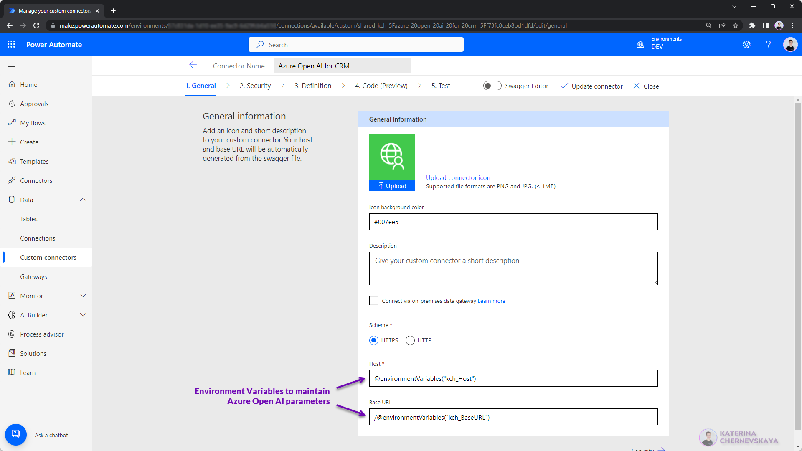
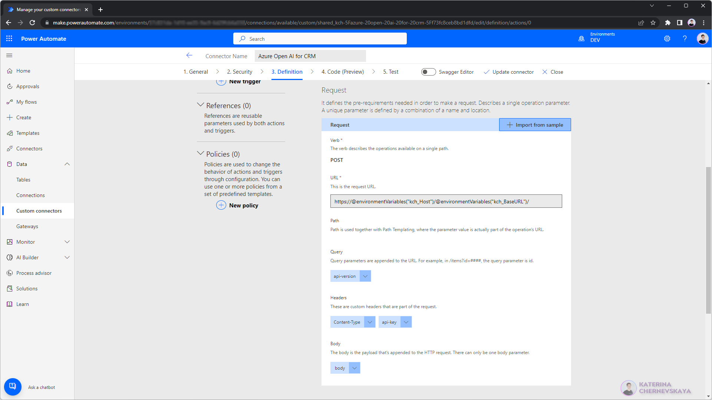

## Applies to

* [Microsoft Power Automate](https://docs.microsoft.com/power-automate/)
* [Azure OpenAI](https://learn.microsoft.com/en-us/azure/cognitive-services/openai/)

## Compatibility

> Don't worry about this section, we'll take care of it. Unless you really want to...

## Authors

Solution|Author(s)
--------|---------
Get-required-info-with-AzureOpenAI_CustomConnector | [Katerina Chernevskaya](https://github.com/Katerina-Chernevskaya) ([LinkedIn](https://www.linkedin.com/in/katerinachernevskaya/)), Awara IT Academy

## Version history

Version|Date|Comments
-------|----|--------
1.0|April 11, 2023|Initial release

## Features

This sample illustrates the following concepts:

* Using variables to store information about Azure OpenAI service parameters for easy and straightforward parameter management
* Creating POST request to Azure OpenAI service to get information
* API response configuration to use received data in the future actions (flows, apps, etc.)

## Prerequisites

* Azure subscription
* Azure OpenAI resource created
* A model deployed using Azure OpenAI
* Saved Azure OpenAI service and model parameters

Follow below steps to create an Azure OpenAI resource and deploy a model in advance.

### Create Azure OpenAI resource

*Currently, access to Azure OpenAI service is granted only by application. You can apply for access to Azure OpenAI by completing the form at [https://aka.ms/oai/access](https://aka.ms/oai/access).*

1. In the browser open the page to create [Azure OpenAI service](https://portal.azure.com/?microsoft_azure_marketplace_ItemHideKey=microsoft_openai_tip#create/Microsoft.CognitiveServicesOpenAI) and login with your credentials
2. On the `Basics` page provide information described bellow and click `Next` button
* `Subscription`: Select the Azure subscription used in your OpenAI onboarding application
* `Resource group`: The Azure resource group that will contain your OpenAI resource. You can create a new group or add it to a pre-existing group.
* `Region`: The location of your instance. Different locations may introduce latency, but have no impact on the runtime availability of your resource.
* `Name`: A descriptive name for your cognitive services resource. For example, MyOpenAIResource.
* `Pricing Tier`: Only 1 pricing tier is available for the service currently
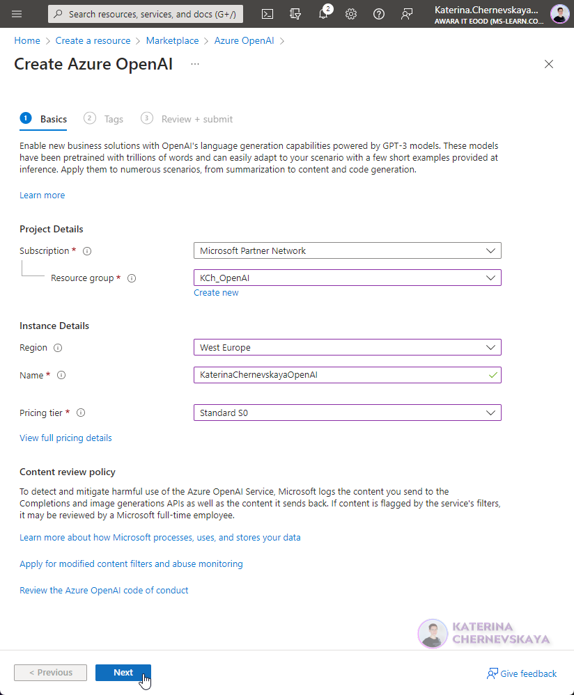
3. On the `Tags` screen click the `Next` button
4. On the `Review + submit` screen click the `Create` button

### Deploy a model
1. Open the Azure OpenAI resource created in the previous step
2. Go to the `Model deployments` tab and click the `Create` button
3. Provide information about the model you would like to create (for this custom connector select the `text-davinci-003` model) and click the `Save` button 

### Save parameters
To launch this custom connector you will need following information: host, base URL and API key. Save this information for later.
1. Go to the `Overview` tab of your Azure OpenAI service and copy `Endpoint` value
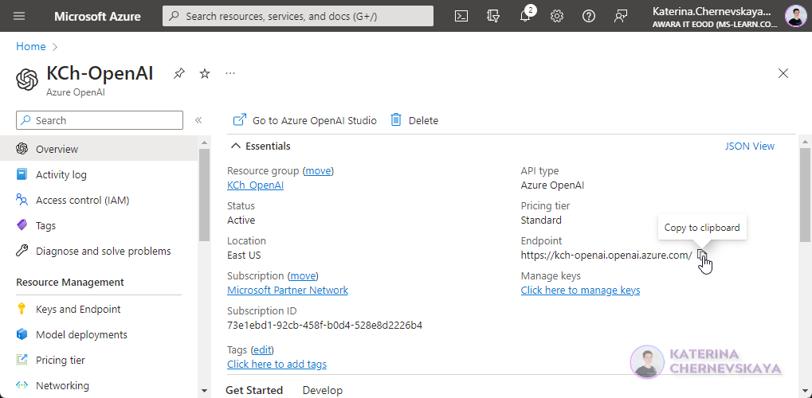
2. Go to the `Keys and Endpoint` tab and copy `KEY 1` value
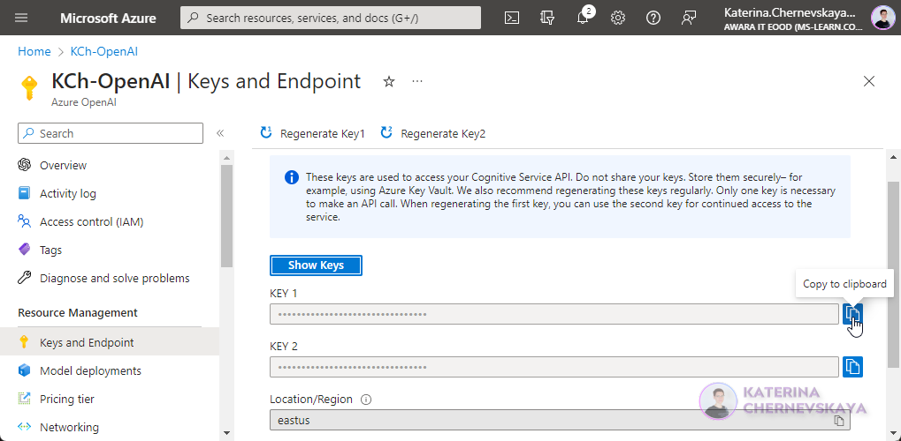
3. Go to the `Model deployments` tab, select your model and click on the `Go to Azure OpenAI Studio` button
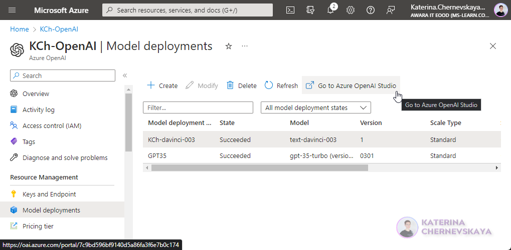
In the opened window click the `Completions playground` button

In the Playground click the `View code` button

In the pop-up window switch to the `json` format and copy Base URL (marked in yellow on the screenshot below)
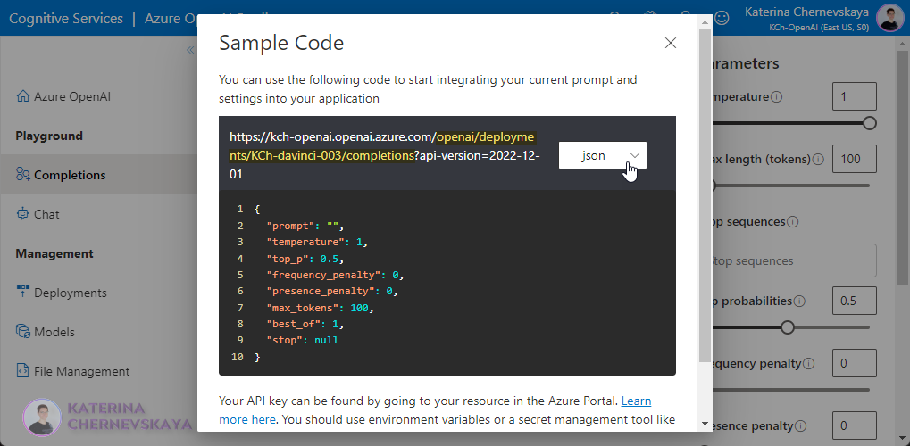

## Minimal Path to Awesome

* Download the `.zip` from the `solution` folder
* Go to [Power Automate Studio](https://make.powerautomate.com/), go to `Solutions` and click `Import solution`

* Select the solution by clicking `Brows` button and press the `Next` button 
* Review all fields on the next screen and click `Next` button
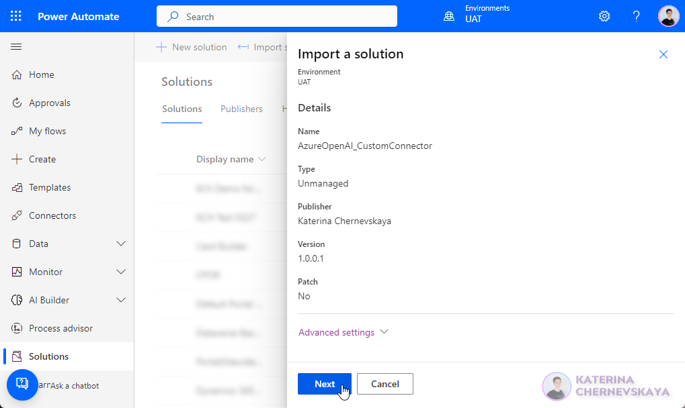
* On the next screen provide information that you stored as prerequsines:
For the `BaseURL` field use the value that you copied from the Playground.
For the `Host` field use the value that you copied from the `Endpoint` field.
Once you are ready - click `Import` button.
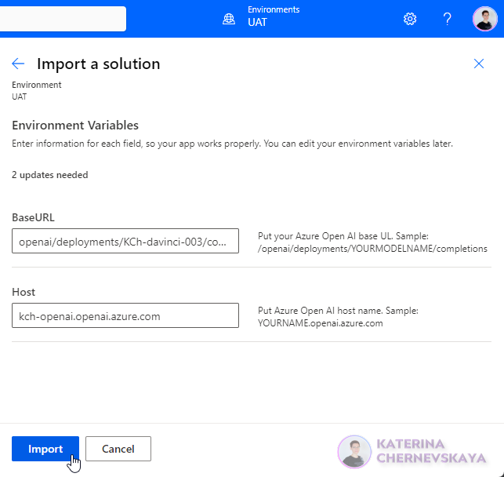

*After the solution will be imported successfully - you will see the notification and the solution will be available in the list.*
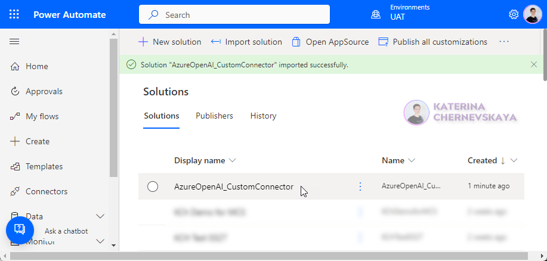

* Open the solution `AzureOpenAI_CustomConnector` and update Environmental Variables value.
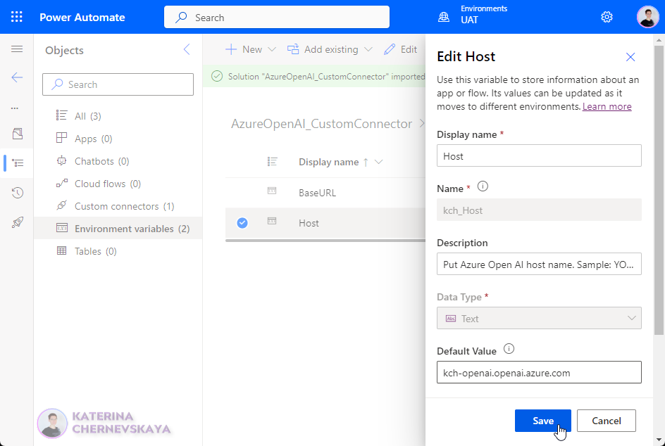

*Once all steps will be completed you can use this custom connector to create connections and leverage its capabilities in your solutions.*

## Disclaimer

**THIS CODE IS PROVIDED *AS IS* WITHOUT WARRANTY OF ANY KIND, EITHER EXPRESS OR IMPLIED, INCLUDING ANY IMPLIED WARRANTIES OF FITNESS FOR A PARTICULAR PURPOSE, MERCHANTABILITY, OR NON-INFRINGEMENT.**

## Help

> Note: don't worry about this section, we'll update the links.

We do not support samples, but we this community is always willing to help, and we want to improve these samples. We use GitHub to track issues, which makes it easy for  community members to volunteer their time and help resolve issues.

If you encounter any issues while using this sample, [create a new issue](https://github.com/pnp/powerautomate-samples/issues/new?assignees=&labels=Needs%3A+Triage+%3Amag%3A%2Ctype%3Abug-suspected&template=bug-report.yml&sample=YOURSAMPLENAME&authors=@YOURGITHUBUSERNAME&title=YOURSAMPLENAME%20-%20).

For questions regarding this sample, [create a new question](https://github.com/pnp/powerautomate-samples/issues/new?assignees=&labels=Needs%3A+Triage+%3Amag%3A%2Ctype%3Abug-suspected&template=question.yml&sample=YOURSAMPLENAME&authors=@YOURGITHUBUSERNAME&title=YOURSAMPLENAME%20-%20).

Finally, if you have an idea for improvement, [make a suggestion](https://github.com/pnp/powerautomate-samples/issues/new?assignees=&labels=Needs%3A+Triage+%3Amag%3A%2Ctype%3Abug-suspected&template=suggestion.yml&sample=YOURSAMPLENAME&authors=@YOURGITHUBUSERNAME&title=YOURSAMPLENAME%20-%20).

## For more information

- [Create your first flow](https://docs.microsoft.com/en-us/power-automate/getting-started#create-your-first-flow)
- [Microsoft Power Automate documentation](https://docs.microsoft.com/en-us/power-automate/)

